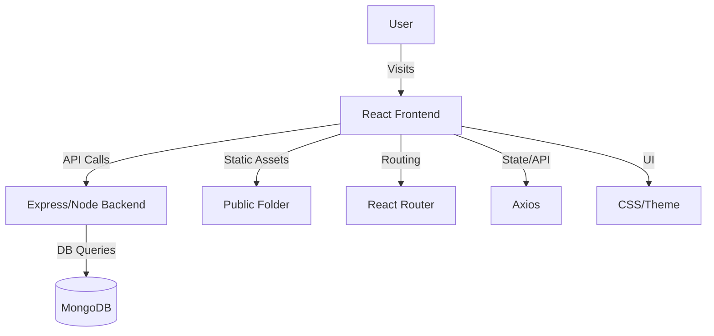

# Food Cravings Frontend

[](https://reactjs.org/) [](https://vitejs.dev/) [](./LICENSE)

A modern, mobile-first frontend for a food video sharing platform. Built with React and Vite, this project enables food partners to upload food videos and users to explore delicious food reels.

---

## Table of Contents
- [About the Project](#about-the-project)
- [Features](#features)
- [Tech Stack](#tech-stack)
- [Project Structure](#project-structure)
- [Getting Started](#getting-started)
- [Environment Variables](#environment-variables)
- [Deployment](#deployment)
- [Contributing](#contributing)
- [License](#license)
- [Acknowledgements](#acknowledgements)

---

## About the Project

Food Cravings Frontend is a React-based web application that allows food partners to showcase their dishes through short videos, while users can browse, like, and interact with food content. The platform aims to make food discovery engaging and visual.

**Problem Solved:**
- Simplifies food partner onboarding and content sharing.
- Provides users with a visually rich, interactive way to discover new dishes and restaurants.

**Screenshots / GIFs:**
<!--


-->

---

## Features
- 🔥 Mobile-first, responsive UI
- 🎥 Video upload with drag-and-drop
- 📝 Food item creation with description
- 👤 User and partner authentication
- 🏠 Home feed with food reels
- 📈 Stats and profile pages for partners
- ⚡ Fast development with Vite

---

## Tech Stack
- **React** (18+)
- **Vite** (build tool)
- **Axios** (API requests)
- **React Router** (routing)
- **FontAwesome** (icons)
- **CSS Modules / Custom CSS**
- *(Optional: Redux, Tailwind, etc. — add/remove as needed)*

---


## Project Structure
```text
frontend/
├── public/
│   └── icons/
├── src/
│   ├── assets/
│   ├── config/
│   ├── pages/
│   │   ├── auth/
│   │   ├── food_partner/
│   │   └── general/
│   ├── routes/
│   ├── styles/
│   ├── App.jsx
│   ├── main.jsx
│   └── ...
├── index.html
├── package.json
├── vite.config.js
└── README.md
```

## Architecture Diagram (Mermaid)



---

## Getting Started

### Prerequisites
- [Node.js](https://nodejs.org/) (v16+ recommended)
- [npm](https://www.npmjs.com/) or [yarn](https://yarnpkg.com/)

### Installation
```bash
# Clone the repository
$ git clone https://github.com/your-username/zomato-reels-frontend.git
$ cd zomato-reels-frontend

# Install dependencies
$ npm install
# or
yarn install
```

### Local Development
```bash
# Start the development server
$ npm run dev
# or
yarn dev
```

The app will be available at [http://localhost:5173](http://localhost:5173) by default.

---

## Environment Variables
Create a `.env` file in the project root:
```env
VITE_API_BASE_URL=http://localhost:3000
# Add other environment variables as needed
```

---

## Deployment

You can deploy this frontend to any static hosting provider (e.g., Netlify, Vercel, GitHub Pages).

### Build for Production
```bash
npm run build
# or
yarn build
```

### Example: Deploy to Netlify
1. Push your code to GitHub.
2. Connect your repo on [Netlify](https://netlify.com/).
3. Set build command to `npm run build` and publish directory to `dist/`.

### Example: Deploy to Vercel
1. Push your code to GitHub.
2. Import your repo on [Vercel](https://vercel.com/).
3. Set up project and deploy.

---

## Contributing

Contributions are welcome! To contribute:
1. Fork the repository
2. Create a new branch (`git checkout -b feature/your-feature`)
3. Commit your changes
4. Push to your fork and open a Pull Request

Please follow the code style and add tests where appropriate.

---

## License

This project is licensed under the **[MIT License](./LICENSE)**.

---

## Acknowledgements
- [React](https://reactjs.org/)
- [Vite](https://vitejs.dev/)
- [FontAwesome](https://fontawesome.com/)
- [Axios](https://axios-http.com/)
- [Zomato (for inspiration)](https://zomato.com/)
- [Other open source libraries](#)

---
